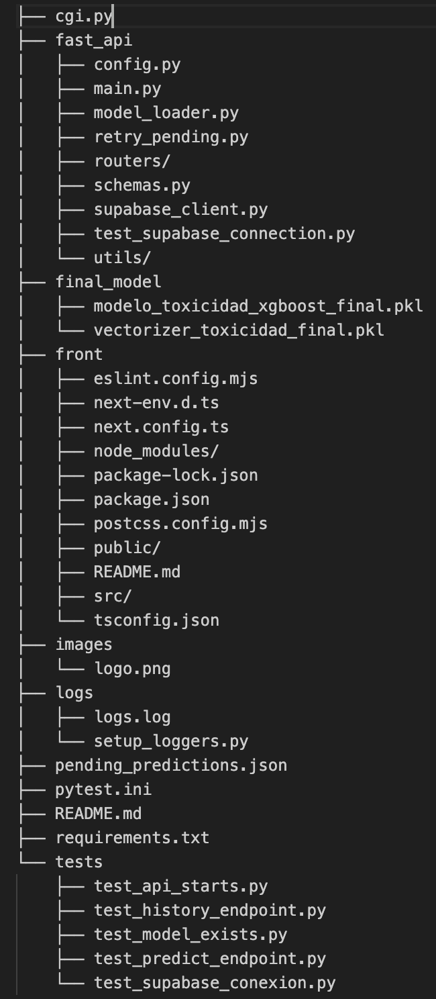
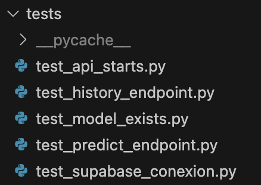
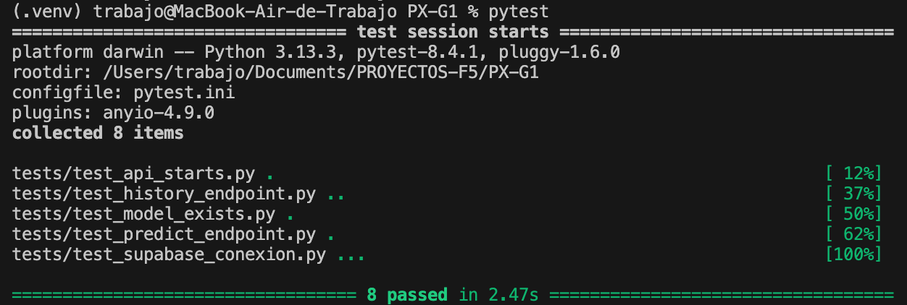
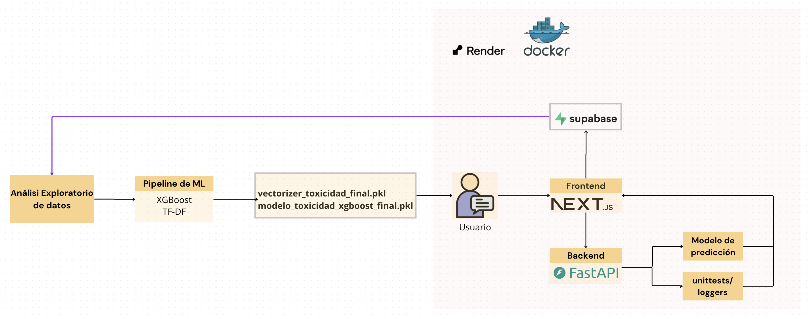

# Proyecto X de NLP: Análisis de Sentimientos para Factoría F5 por el grupo 1.

Andrea Alonso

Mariela Adimari

César Mercado

Alla Haruty

## Propósito y Alcance

Este proyecto es una aplicación web impulsada por aprendizaje automático, diseñada para analizar texto y detectar contenido tóxico. Ofrece dos funcionalidades principales:

- **Análisis de comentarios individuales:** Mediante la inserción de un texto.
- **Análisis masivo de comentarios de videos de YouTube:** Mediante la inserción de la URL del vídeo de YouTube

Los resultados se almacenan en una base de datos persistente en Supabase y se utilizarán posteriormente para el reentrenamiento del modelo.

---

## Arquitectura del Sistema

El sistema sigue una arquitectura de tres capas:

1. **Capa de Presentación**: Frontend construido con Next.js.
2. **Capa de Aplicación**: Backend construido con FastAPI.
3. **Capa de Datos**: Base de datos Supabase con mecanismo de respaldo local en caso que la conexión no sea exitosa.

### Componentes Principales

- **Frontend (Next.js)**: Interfaz de usuario y cliente de API.
- **Backend (FastAPI)**:
  - `predictions.py`: Ruta principal para predicciones.
  - `model_loader.py`: Carga del modelo ML y vectorizador.
  - `extract_youtube_comments.py`: Extracción de comentarios de YouTube.
  - `fallback.py`: Mecanismo de respaldo en caso de fallo en base de datos.
  - `retry_pending.py`: Función para subir a la base de datos los datos que tenemos en local.
- **Persistencia de Datos**:
  - Base de datos Supabase.
  - Archivo local `pending_predictions.json` como respaldo si falla la conexión con Supabase.

---

## Modelos de Machine Learning

- **Vectorizador TF-IDF**: `vectorizer_toxicidad_final.pkl`
- **Clasificador XGBoost**: `modelo_toxicidad_xgboost_final.pkl`

Proceso de predicción:
1. Entrada de texto ó URL del vídeo.
2. Vectorización con TF-IDF.
3. Clasificación con XGBoost.
4. Salida: Etiqueta de toxicidad y puntaje.

---

## Endpoints de la API

| Endpoint                 | Método | Descripción                               |
|--------------------------|--------|-------------------------------------------|
| `/predict`               | POST   | Análisis de un comentario individual.     |
| `/predict/youtube`      | POST   | Análisis de comentarios de un video.      |
| `/history`              | GET    | Recupera historial de predicciones.       |

### Flujo de Datos

- **Entrada**: Comentario o URL de video de YouTube.
- **Procesamiento**: Extracción → Traducción (si aplica) → Predicción.
- **Salida**: Puntaje de toxicidad, etiqueta, y versión del modelo, guardado en base de datos o local.

---

## Estrategia de Persistencia

- **Primario**: Inserciones en Supabase.
- **Secundario (Fallback)**:
  - En caso de error de conexión, los datos se almacenan en `pending_predictions.json`.
  - Se reintentan manualmente cuando se restablece la conexión (`retry_pending.py`).

---

## Procesamiento de Comentarios de YouTube

1. URL del video como entrada.
2. `extract_comments()` extrae comentarios.
3. `translate_if_needed()` traduce si es necesario.
4. Los comentarios se procesan en lote por el modelo.
5. Se devuelve un resumen con toxicidad promedio.

---

## Dependencias Principales

- [`FastAPI`](https://fastapi.tiangolo.com/) - Backend web framework.
- [`scikit-learn`](https://scikit-learn.org/) - Vectorización TF-IDF.
- [`xgboost`](https://xgboost.readthedocs.io/) - Clasificación ML.
- [`supabase`](https://supabase.com/) - Base de datos en la nube.
- [`youtube-comment-downloader`](https://pypi.org/project/youtube-comment-downloader/) - Extracción de comentarios.
- [`deep-translator`](https://pypi.org/project/deep-translator/) - Traducción multilingüe.

---

## Manejo de Errores y Resiliencia

- **Respaldo Local**: Fallback automático si Supabase no está disponible.
- **Reintentos**: Los datos pendientes se reintentan subir manualmente.
- **Validación de Entrada**: Modelos Pydantic garantizan datos válidos.
- **Registro de Errores**: Se registran excepciones para depuración.

---

## 📁 Estructura del repositorio

</img>


## Dockerización

Tanto el Backend como el Frontend están dockerizados y la imagen está subida a Dockerhub y se pueden descargar con el siguiente comando:

- **Imagen Frontend:** `docker push allaharuty/px-g1-frontend:tagname`

- **Imagen Backend:** `docker push allaharuty/px-g1-app:tagname`

Ver código fuente en [la rama feature/docker.](https://github.com/Bootcamp-IA-P4/PX-G1/tree/feature/docker)

## Despliegue

Además, se han desplegado en render los 2 servicios:

- [Backend](https://backend-sentimientos.onrender.com/)

- [Frontend](https://frontend-sentimientos.onrender.com)


## Pon en marcha el proyecto

1. Abre un terminal
2. ```git clone https://github.com/Bootcamp-IA-P4/PX-G1.git```
3. Pega el .env que se te ha proporcionado
4. ```pip install -r requirements.txt```
5. ```uvicorn fast_api.main:app --reload```
6. Abre nuevo terminal
7. ```cd front```
8. ```npm install```
9. ```npm run dev```

Ya puedes acceder al proyecto:

- Puerto backend: `http://127.0.0.1:8000`
- Puerto frontend: `http://localhost:3000`


## Test unitarios y loggers

Se integran **8 unittests** divididos en 5 archivos que comprueban el buen funcionamiento del backend y loggers que llevan la trazabilidad de toda la aplicación y se guardan en logs/logs.log

</img>
</img>

Para probarlo desde la raíz del repositorio:

```
pip install -r requirements.txt
pytest
```

## Diagrama de arquitectura

</img>

# Metodología trabajada y equipo

El equipo ha trabajado en conjunto en los primeros pasos como el Análisis Exploratorio de Datos y el entrenamiento del Modelo adecuado y tras una comparación de los resultados de cada integrante, se ha realizado un EDA en conjunto extrayendo todo lo común e interesante y se ha escogido el modelo con las mejores métricas.

## Nuestro modelo elegido fue XGBoost:
Tras la optimizacion de hiperparametros con Optuna nos dio las siguientes metricas


### 🎯 F1 Score

| Tipo       | Valor          | Significado                                                                                                   |
| ---------- | -------------- | ------------------------------------------------------------------------------------------------------------- |
| `Train F1` | 0.9420         | Rendimiento en el conjunto de entrenamiento. Muy alto: el modelo se ajusta bien a los datos de entrenamiento. |
| `CV F1`    | 0.8574 ±0.0073 | Promedio del F1 score en validación cruzada. Buena generalización.                                            |
| `Test F1`  | 0.8977         | Rendimiento en el conjunto de test. Algo más bajo que `Train`, lo cual es esperable.                          |

🔍 Gap overfitting F1: 0.0443

    Diferencia entre Train F1 y Test F1. Un gap pequeño (<0.05) indica que no hay sobreajuste severo.

### 📉 LogLoss (Logarithmic Loss)
Esta métrica penaliza más cuando el modelo está muy seguro y se equivoca. Cuanto más bajo, mejor.

| Tipo                              | Valor                                          | Significado                                    |
| --------------------------------- | ---------------------------------------------- | ---------------------------------------------- |
| `Train LogLoss`                   | 0.2531                                         | Error promedio de predicción en entrenamiento. |
| `Test LogLoss`                    | 0.3083                                         | Error promedio en test.                        |
| `Gap overfitting LogLoss: 0.0552` | Diferencia entre ambos. Aceptable si es < 0.1. |                                                |

### 🏁 Modelo final

- **Train F1:** 0.9427

- **Test F1:** 0.8958

- **CV F1:** 0.854 ±0.014 (estable)

- **Overfitting gap F1:** 0.0469 → Buena generalización

- **Train LogLoss:** 0.2552 | Test LogLoss: 0.3093 

- **Overfitting gap LogLoss:** 0.0541 → Bajo

### 📌 Conclusión:
El modelo está bien entrenado, con buen rendimiento en todos los conjuntos y sin señales graves de overfitting.

Se pueden ver los EDAs realizados en la carpeta EDAs de la rama [feature/EDA](https://github.com/Bootcamp-IA-P4/PX-G1/tree/feature/EDA) donde cada integrante tiene su propio archivo. 

Y se pueden ver los entrenamientos de los modelos en la carpeta models en la rama [feature/model](https://github.com/Bootcamp-IA-P4/PX-G1/tree/feature/model) también con sus respectivos archivos.

- [Para ver el EDA final haz click aquí](https://github.com/Bootcamp-IA-P4/PX-G1/blob/feature/EDA/EDAs/FINAL-EDA.ipynb) 📌

- [Para ver el entrenamiento del modelo final haz click aquí](https://github.com/Bootcamp-IA-P4/PX-G1/blob/feature/model/models/Marie-models.ipynb) 📌

Además, para mejorar la explicabilidad de nuestro modelo y comprender cómo influye cada característica del conjunto de datos en sus predicciones, hemos creado un archivo llamado [`shap_explainer.ipynb`](https://github.com/Bootcamp-IA-P4/PX-G1/blob/feature/model/models/shap_explainer.ipynb) 📌


## Deepwiki

Puedes saber más sobre el proyecto en [este link de Deepwiki.](https://deepwiki.com/Bootcamp-IA-P4/PX-G1/1-overview)


